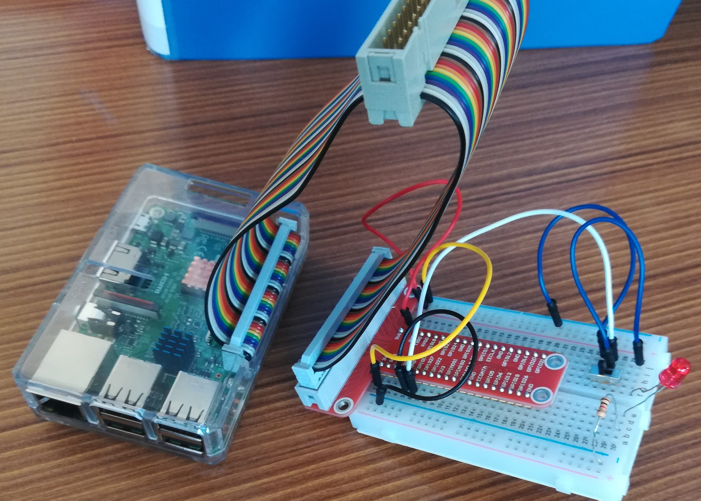
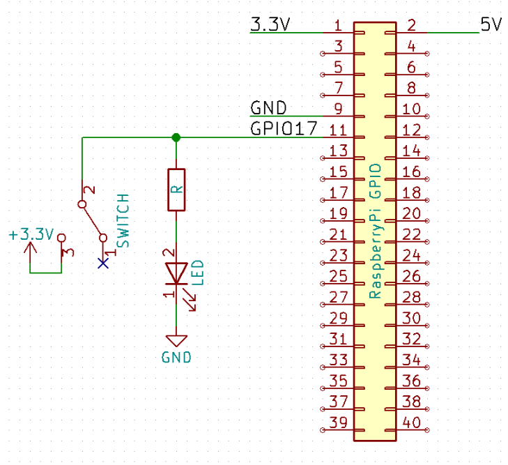
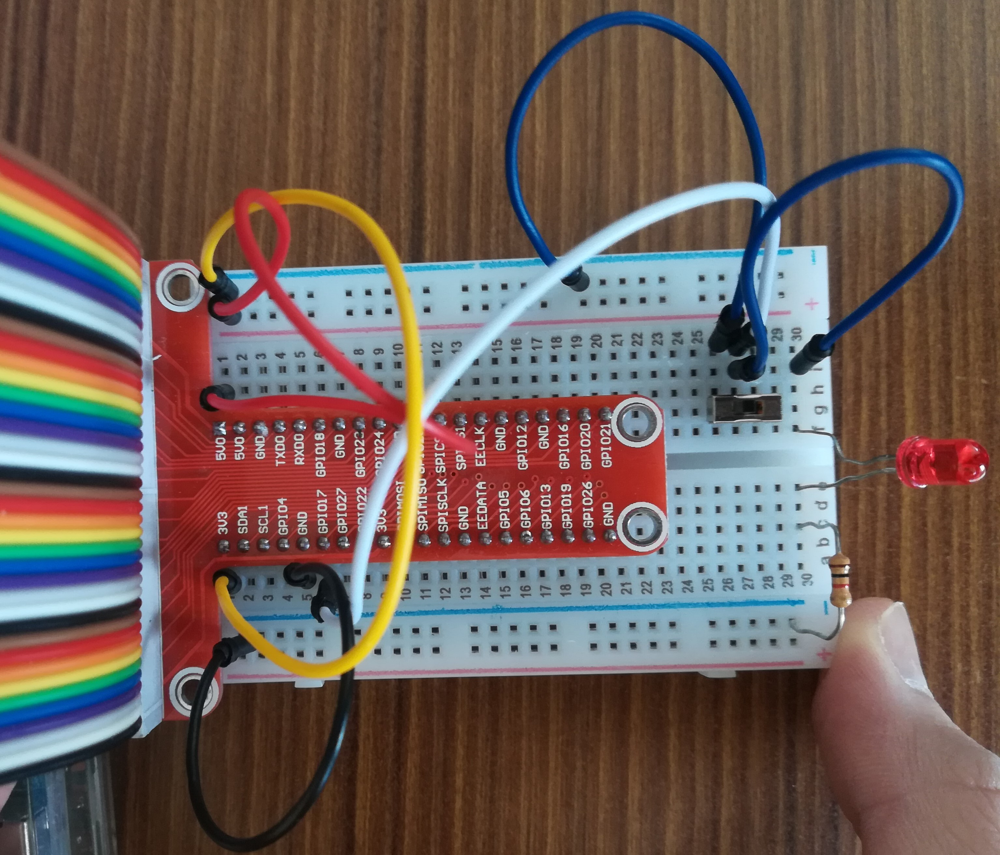
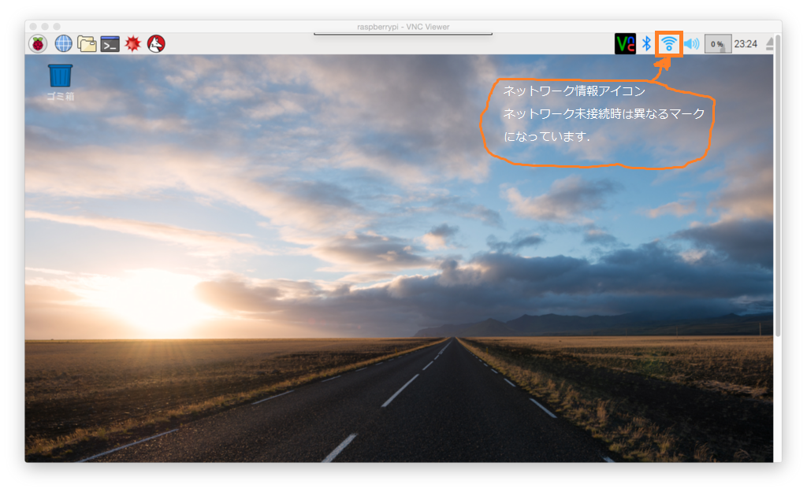

# はじめに

### この文書について

このドキュメントは大分県技術・市場交流プラザ大分(以下プラザ大分)が企画している製品開発プロジェクト
Storage Management Assistant Partner(以下SMAP)の第一フェーズの開発資料です.


### フェーズ1 開発内容

開発要件は以下の通り

> * 押しボタン式スイッチのON/OFF状態をWebで表示すること
> * android端末のChromeブラウザで正常に表示されること
> * Wifiが使用できる環境で稼働すること
> * 電源には家庭用電源を使用すること
> * RaspberryPiシリーズのいずれかを用いてWebサーバを構築すること
> * 産業創造機構ビルなどの大分高専以外の建物でも動作が確認できること


# 使い方

以下は既にRaspberryPiをセットアップ済みとした使い方です.
RaspberryPi及び必要なプラットフォームを一からセットアップする場合は
`docs/setup.md`を見てください.

## 動作環境
* ハードウェア:RaspberryPi3 ModelB
* OS: Raspbian Stretch(November 2017)
* プラットフォーム: Node.js v8.9.4 + Socket.io
* プロジェクト展開フォルダ: /home/pi/Desktop/SMAP

## 使用方法

#### 1. RaspberryPiとブレッドボードの接続
RaspberryPiのGPIO端子とブレッドボードを接続します.  
写真のようにRaspberryPi側にフラットケーブルのメスコネクタを,
ブレッドボードにDIPコネクタ(赤くてGPIO1等の文字が印字されている端子)を接続します.
RaspberryPiへのフラットケーブル接続時には向きに注意してください(写真の向きに接続する).
写真でブレッドボード上に接続されているスイッチやLED,ジャンパワイヤなどの結線は次節で説明するのでこの時点で配線する必要はありません.




#### 2. ブレッドボード上に回路を結線
以下の回路図にしたがってブレッドボート上に回路を組みます.



以下の写真は実際に接続した時の配線例です.



#### 3. Raspberry Pi起動+ネットワーク設定

RaspberryPiを電源に接続して起動します.  
新しいネットワークの場合は新たに接続する必要があります.
ネットワークへの接続はWindowsでの接続と同じような操作で接続をすることができます.
デスクトップ右上の音量マークの左のアイコンをクリックし,接続したいSSIDを選択して
パスワードを入力するだけです.



#### 4. ファイアウォール設定
次に,ファイアウォールの設定を行います.  
ファイアウォールとはコンピュータが悪意のあるデータを送受信しないように,
特定のアプリケーションに関する通信だけを許可/ブロックしたりする機能です.
今回はRaspberryPiから外部のスマートフォンに対してデータを送信するため,これに使用する
ポート番号の通信をファイアウォールによって許可する必要があります.

`Ctrl + Alt + T`キーでターミナルを起動.以下のコマンドからファイアウォール設定ツールを実行します.

```
pi@raspberrypi:~$cd ~/Desktop/SMAP
pi@raspberrypi:~$bash tools/firewalltool.sh
```
> ファイアウォール設定ツールとは今回のIoT開発のための,
> 接続ネットワーク内(ローカルネットワーク)でRaspberryPi
> 本体とandroid端末との通信を行えるようにするためのファイアウォール自動設定スクリプトです.  
> `bash tools/firewalltool.sh [ポート番号]`のように実行しますが,
> ポート番号の部分に何も指定しないとデフォルトとしてポート8080が使用されます.
> 今回はデフォルトのポート番号8080で進めていきます.

#### 5. サーバー起動・スマートフォンからアクセス
ファイアウォール設定が終わったら,引き続きターミナルから

```
pi@raspberrypi:~$ bash ./start.sh
```

を実行してサーバーを起動し,コンソールに表示されるURLに
ネットワーク内のスマートフォン等からアクセスします.
SWITCH STATUS:の下にスイッチ状態が`ON`や`OFF`と表示されれば成功です.
